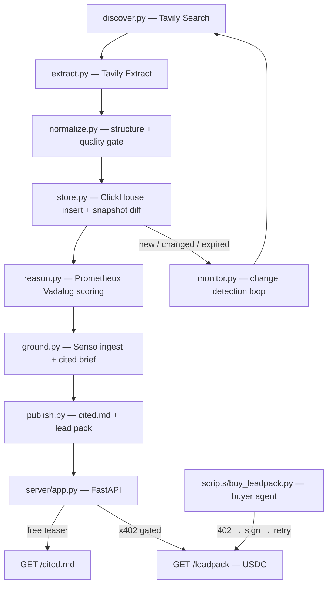

# Tender Opportunity Agent

> An autonomous agent that monitors the open web for fresh **AI / data / cloud / analytics / digital-transformation** tenders, turns them into a **ranked opportunity brief grounded in real sources**, publishes a cited report to [`cited.md`](cited.md), monitors for changes over time, and **monetizes premium lead packs behind x402 agent payment rails**.

---

## Table of contents

- [Overview](#overview)
- [Features](#features)
- [How it works](#how-it-works)
- [Tools used](#tools-used)
- [Prerequisites](#prerequisites)
- [Installation](#installation)
- [Configuration](#configuration)
- [Usage](#usage)
  - [Run the pipeline once](#1-run-the-pipeline-once)
  - [Serve the monetized API](#2-serve-the-monetized-api)
  - [Continuous monitoring](#3-continuous-monitoring)
  - [Pay the paywall (buyer agent)](#4-pay-the-paywall-buyer-agent)
- [API reference](#api-reference)
- [How scoring works](#how-scoring-works)
- [Output artifacts](#output-artifacts)
- [Project structure](#project-structure)
- [Monetization details (x402)](#monetization-details-x402)
- [Live vs mock mode](#live-vs-mock-mode)
- [Troubleshooting](#troubleshooting)
- [Roadmap](#roadmap)
- [License](#license)
- [Acknowledgements](#acknowledgements)

---

## Overview

Consultancies, startups, systems integrators, and sales teams spend hours hunting public-sector and enterprise tenders across dozens of portals. The **Tender Opportunity Agent** automates that work end-to-end:

1. **Discovers** fresh tenders on the live web.
2. **Extracts** clean evidence (buyer, value, deadline, scope) from each notice.
3. **Validates** records through a quality gate.
4. **Stores** them in an analytics database and **detects changes** across runs.
5. **Ranks** each opportunity by commercial fit using an explainable rules engine.
6. **Grounds** the brief in a verified knowledge base with citations.
7. **Publishes** a public, cited markdown report ([`cited.md`](cited.md)).
8. **Monetizes** a richer "lead pack" behind an HTTP 402 agent-payment paywall.

The result is real, autonomous work on the open web: it searches live sources, extracts evidence, evaluates fit, persists and monitors state, publishes a public artifact, and transacts via agent payment rails.

## Features

- **Live web discovery** across a configurable query set, biased toward known tender portals (TED, Find a Tender, SAM.gov, UNGM, etc.).
- **Query-focused evidence extraction** into clean markdown.
- **Quality gate**: a record must have a title, a source URL, and at least one hard commercial signal (value or future deadline) to qualify.
- **Explainable commercial-fit scoring** (0–100) with a human-readable rationale per opportunity.
- **Change monitoring**: per-run snapshots surface `NEW` / `UPDATED` / `EXPIRED` tenders.
- **Grounded, cited output**: every figure traces back to a source notice.
- **Agent-native monetization**: free teaser + x402-gated premium lead pack (USDC on Base Sepolia, mainnet-ready via CDP).
- **Graceful degradation**: runs fully offline with deterministic mocks when API keys are absent, then switches to live services when keys are present.

## How it works



## Tools used

The challenge requires 3+ of the specified tools; this project uses **all five**.

| Tool | Role in the agent |
| --- | --- |
| **Tavily** | Live web search + clean, query-focused evidence extraction (grounding) |
| **Prometheux (Vadalog)** | Rule-based reasoning engine that scores commercial fit with explanations |
| **Senso.ai** | Verified knowledge base + grounded, cited brief content |
| **ClickHouse** | Analytics store, per-run snapshots, and change detection |
| **x402 / CDP** | HTTP 402 payment-gated premium lead pack (USDC on Base Sepolia) |
| _Cursor_ | The build environment for the whole project |

## Prerequisites

- **Python 3.9+** (3.11 recommended).
- **pip** and `venv`.
- **Docker** (optional) — only to run a local ClickHouse. Without it, the agent uses a local JSON store automatically.
- **API keys** (all optional — each missing key just degrades that stage to mock):
  - Tavily API key
  - Prometheux token + JarvisPy URL
  - Senso API key
  - A funded Base Sepolia wallet (only for a live paid round-trip)

## Installation

```bash
# Clone, then from the repo root:
python -m venv .venv
source .venv/bin/activate          # Windows: .venv\Scripts\activate
pip install -r requirements.txt

# Copy the environment template and edit as needed
cp .env.example .env
```

Optionally start a local ClickHouse:

```bash
docker compose up -d               # ClickHouse on http://localhost:8123
```

## Configuration

All configuration is via environment variables (loaded from `.env` if present). See [`.env.example`](.env.example) for the full template.

| Variable | Purpose | Default |
| --- | --- | --- |
| `TAVILY_API_KEY` | Enables live web discovery + extraction | _(mock)_ |
| `PMTX_TOKEN` | Prometheux auth token | _(mock)_ |
| `JARVISPY_URL` | Prometheux JarvisPy base URL (`.../jarvispy/<org>/<user>`) | _(mock)_ |
| `SENSO_API_KEY` | Enables Senso grounding + citations | _(mock)_ |
| `SENSO_BASE_URL` | Senso API base URL | `https://api.senso.ai/v1` |
| `CLICKHOUSE_HOST` / `_PORT` / `_USER` / `_PASSWORD` / `_DATABASE` | ClickHouse connection | `localhost:8123`, `default`, `tenders` |
| `X402_RECEIVING_ADDRESS` | Wallet that collects payments — **set this to enable gating** | zero address (ungated) |
| `X402_FACILITATOR_URL` | x402 facilitator | `https://x402.org/facilitator` |
| `X402_NETWORK` | CAIP-2 network id (Base Sepolia / Base mainnet) | `eip155:84532` |
| `X402_LEADPACK_PRICE` | Premium price | `$0.10` |
| `BUYER_PRIVATE_KEY` | Buyer wallet key (only for `buy_leadpack.py`) | _(none)_ |
| `MAX_RESULTS_PER_QUERY` | Tavily results per query | `5` |
| `MAX_TENDERS_PER_RUN` | Cap on candidates processed | `40` |
| `FREE_TIER_LIMIT` | Opportunities shown in `cited.md` | `10` |
| `SEARCH_RECENCY_DAYS` | Recency window for discovery | `30` |
| `SERVER_HOST` / `SERVER_PORT` | API bind address | `0.0.0.0:4021` |
| `MONITOR_INTERVAL_MINUTES` | Monitor loop cadence | `360` (6h) |

## Usage

### 1. Run the pipeline once

```bash
python scripts/run_once.py
```

Runs the full chain and writes [`cited.md`](cited.md) (public brief) and `data/leadpack.json` (premium payload). Run it again to see change detection (`new` / `updated` / `unchanged` / `expired`) against the prior run.

Example output:

```
[pipeline] config -> Tavily: MOCK | Prometheux: MOCK | Senso: MOCK | ClickHouse: localhost:8123 | x402: eip155:84532 ...
[pipeline] discovered 6 candidates
[pipeline] 6 tenders passed the quality gate
[pipeline] change detection -> run=... new=6 changed=0 unchanged=0 expired=0
[pipeline] scored & ranked 6 opportunities
[pipeline] published -> .../cited.md
```

### 2. Serve the monetized API

```bash
python scripts/serve.py                       # default port 4021
SERVER_PORT=4022 python scripts/serve.py       # use another port if 4021 is busy
```

Then:

```bash
curl http://localhost:4021/                    # service info + tool LIVE/MOCK status
curl http://localhost:4021/cited.md            # free brief (markdown)
curl -i http://localhost:4021/leadpack         # 402 if gated, JSON if ungated demo mode
curl -X POST http://localhost:4021/refresh     # re-run the pipeline on demand
```

### 3. Continuous monitoring

```bash
python -m src.monitor                          # loops every 6h with backoff
MONITOR_INTERVAL_MINUTES=30 python -m src.monitor
```

Each cycle re-scans the web, diffs against the store, regenerates `cited.md`, and logs new/changed/expired tenders.

### 4. Pay the paywall (buyer agent)

`scripts/buy_leadpack.py` simulates an autonomous buyer that pays the 402 and fetches the pack.

```bash
# a. Generate a test wallet and fund it on Base Sepolia (test ETH + USDC)
python scripts/buy_leadpack.py --new-wallet
#    Faucet: https://portal.cdp.coinbase.com/products/faucet

# b. Start the server gated (set a receiving wallet)
X402_RECEIVING_ADDRESS=0xYourReceivingWallet python scripts/serve.py

# c. Pay and fetch (signs USDC EIP-3009, retries with payment, receives the pack)
BUYER_PRIVATE_KEY=0xYourBuyerKey python scripts/buy_leadpack.py
```

The buyer handles the `402 → sign → retry` loop automatically via the x402 httpx client. A real settlement requires the buyer wallet to hold test USDC + ETH on Base Sepolia.

## API reference

| Method & path | Access | Description |
| --- | --- | --- |
| `GET /` | free | Service metadata + which tools are LIVE/MOCK + whether monetization is gated |
| `GET /healthz` | free | Liveness probe |
| `GET /cited.md` | free | The published opportunity brief (markdown) |
| `GET /leadpack` | **paid (x402)** | Full enriched lead pack (all opportunities, evidence, rationale, watchlist) |
| `POST /refresh` | free | Trigger a fresh pipeline run |

When `X402_RECEIVING_ADDRESS` is unset, `/leadpack` is served ungated for demos. When set, an unpaid request returns **HTTP 402** with x402 payment terms.

## How scoring works

Commercial fit is scored 0–100 by the Vadalog rules in [`vadalog/scoring.vada`](vadalog/scoring.vada), evaluated on Prometheux (or by an identical local implementation in `src/reason.py` when Prometheux is not configured). Weights:

| Signal | Max | Logic |
| --- | --- | --- |
| Sector | 30 | `ai` 30, `analytics` 25, `data` 22, `cloud` 20, `digital_transformation` 18, `other` 5 |
| Value band | 30 | `mega` 30, `large` 24, `mid` 16, `small` 8, `unknown` 4 |
| Deadline window | 20 | Rewards an actionable, not-too-tight window (14–90 days = 20) |
| Recency | 12 | Fresher notices score higher |
| Keyword signals | 8 | More matched sector keywords = stronger signal |

Ranking tie-breakers (deterministic): fit desc → deadline asc → value desc → published desc. A separate **confidence** score (0–100) reflects evidence completeness (value, deadline, buyer, sector, published date known).

## Output artifacts

- **[`cited.md`](cited.md)** — the public, free brief: executive summary, top-N ranked table, per-opportunity detail, citations, and a methodology footer.
- **`data/leadpack.json`** — the premium payload served behind the paywall: every opportunity with full evidence, scoring breakdown, buyer detail, `first_seen`, Senso doc ids, citations, and the change-history watchlist.
- **`data/state.json`** — local fallback store (when ClickHouse is unavailable), used for change detection.

## Project structure

```
.
├── config.py                 # env-driven settings + LIVE/MOCK flags, query set, sector keywords
├── requirements.txt
├── docker-compose.yml        # local ClickHouse
├── .env.example
├── cited.md                  # published artifact (generated)
├── vadalog/
│   └── scoring.vada          # commercial-fit ranking rules (Prometheux/Vadalog)
├── src/
│   ├── models.py             # shared dataclasses (Candidate, Tender, ScoredTender)
│   ├── discover.py           # Stage 1: Tavily search
│   ├── extract.py            # Stage 2: Tavily extract (evidence)
│   ├── normalize.py          # Stage 3: structure + quality gate
│   ├── store.py              # Stage 4: ClickHouse schema, insert, snapshot diff (+ JSON fallback)
│   ├── reason.py             # Stage 5: Prometheux Vadalog scoring + explanations
│   ├── ground.py             # Stage 6: Senso ingest + grounded cited brief
│   ├── publish.py            # Stage 7: render cited.md + build lead pack
│   ├── monitor.py            # Stage 8: scheduled change-detection loop
│   └── pipeline.py           # end-to-end orchestration
├── server/
│   └── app.py                # Stage 9: FastAPI + x402 (free teaser + paid lead pack)
└── scripts/
    ├── run_once.py           # one-shot pipeline run
    ├── serve.py              # launch the API
    └── buy_leadpack.py       # buyer agent: pays the x402 paywall and fetches the pack
```

## Monetization details (x402)

- **Protocol**: [x402](https://docs.x402.org) revives HTTP `402 Payment Required` for programmatic, account-free payments — ideal for autonomous agents.
- **Asset / network**: USDC on **Base Sepolia** (`eip155:84532`) by default; price `$0.10` (`amount: 100000`, 6 decimals).
- **Facilitator**: signup-free `https://x402.org/facilitator` for testnet.
- **Flow**: client requests `/leadpack` → server returns 402 with `payment-required` terms → client signs an EIP-3009 USDC authorization → retries with the payment signature → facilitator settles → server returns the pack.
- **Going to mainnet**: set `X402_FACILITATOR_URL=https://api.cdp.coinbase.com/platform/v2/x402` and `X402_NETWORK=eip155:8453` (requires CDP API keys and a funded mainnet wallet).

## Live vs mock mode

The agent never blocks on missing credentials. At startup it prints each tool's mode, e.g.:

```
Tavily: LIVE | Prometheux: MOCK | Senso: MOCK | ClickHouse: localhost:8123 | x402: eip155:84532 @ https://x402.org/facilitator
```

- **Tavily mock** → a built-in corpus of realistic tender notices.
- **Prometheux mock** → identical local implementation of the Vadalog weights.
- **Senso mock** → a deterministic, source-cited summary built from the evidence.
- **ClickHouse unavailable** → local `data/state.json` store (change detection still works).
- **x402 ungated** → `/leadpack` served without payment for demos.

This makes the project fully runnable offline, then production-grade by simply adding keys.

## Troubleshooting

- **`address already in use` on serve** — another server is bound to the port. Free it (`lsof -nP -iTCP:4021 -sTCP:LISTEN` then `kill -9 <pid>`) or run on another port (`SERVER_PORT=4022 python scripts/serve.py`).
- **`/leadpack` returns 500 with "Connection refused"** — the x402 middleware can't reach the facilitator (no network / firewall). Ensure outbound access to `X402_FACILITATOR_URL`.
- **`/leadpack` not gated** — `X402_RECEIVING_ADDRESS` is unset or the zero address; set a real wallet to enable payment.
- **ClickHouse auth/connection errors** — the agent falls back to the local JSON store automatically; fix `CLICKHOUSE_*` or run `docker compose up -d` for persistence.
- **`x402[evm]` import error (`eth_abi` missing)** — ensure `pip install "x402[fastapi,evm]"` (already in `requirements.txt`).

## Roadmap

- Buyer-contact and procurement-ID enrichment in the premium pack.
- Configurable per-sector weighting profiles.
- Webhook/Slack notifications on new high-fit tenders.
- Bazaar discovery so other agents can find and pay for the lead pack autonomously.
- "upto" x402 scheme for usage-based pricing.

## License

MIT — see headers / add a `LICENSE` file as needed.

## Acknowledgements

Built with [Tavily](https://tavily.com), [Prometheux](https://prometheux.ai), [Senso.ai](https://senso.ai), [ClickHouse](https://clickhouse.com), and [x402 / Coinbase Developer Platform](https://docs.cdp.coinbase.com/x402/welcome), in [Cursor](https://cursor.com).
