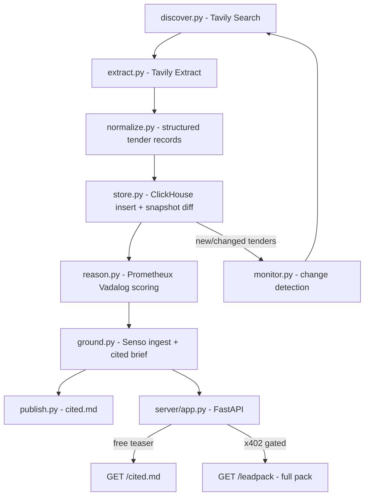

# Tender Opportunity Agent

An autonomous agent that monitors the open web for fresh AI / data / cloud / analytics / digital-transformation tenders, turns them into a ranked opportunity brief grounded in real sources, publishes a cited report to `cited.md`, and gates premium lead packs behind x402 agent payments.

## Tool mapping (uses all 5 required tools, well over the 3+ minimum)

- **Tavily Search + Extract** — live web discovery of tenders and clean, query-focused evidence extraction (grounding).
- **Senso.ai** — ingest extracted source text into a verified knowledge base, produce grounded/cited brief content, and act as the source-of-truth for citations.
- **Prometheux (Vadalog)** — rule-based reasoning engine that scores commercial fit and emits explainable ranked opportunities. (Deduplication happens upstream in `discover.py`/`normalize.py` via URL and stable-id keys, not in the rules engine.)
- **ClickHouse** — analytics store for tenders, per-run snapshots, and change detection over time (monitoring).
- **Cursor** — the build environment for the whole project.
- **x402 / CDP** — monetization: HTTP 402 payment-gated premium endpoint (USDC on Base Sepolia via the signup-free `x402.org` facilitator).

## Architecture / data flow

## Pipeline stages

1. **Discover** (`src/discover.py`): run Tavily `search` across a query set (e.g. "RFP AI services", "government cloud migration tender", "data analytics procurement", with `topic`/`days` recency filters) to collect candidate tender URLs + snippets.
2. **Extract** (`src/extract.py`): Tavily `extract(urls=..., extract_depth="advanced", query=..., chunks_per_source=3)` to pull clean markdown evidence per source.
3. **Normalize** (`src/normalize.py`): parse evidence into a `Tender` record: `id` (hash of url), `title`, `buyer`, `country`, `sector`, `value_band`, `deadline`, `published`, `url`, `evidence_snippet`, `content_hash`.
4. **Store** (`src/store.py`): `clickhouse-connect` client; tables `tenders`, `tender_snapshots` (run_id + content_hash for diffing), `scores`. Insert + compute new/changed set.
5. **Reason / Rank** (`src/reason.py` + `vadalog/scoring.vada`): feed tender facts to Prometheux via `prometheux_chain` (`save_concept` / `run_concept`) or the JarvisPy `POST /api/v1/vadalog/evaluate` REST route; Vadalog rules sum weighted signals (sector match, value band, days-to-deadline window, recency, keyword signal count) into a `fit_score` with an explanation.
6. **Ground** (`src/ground.py`): push extracted source markdown to Senso `POST /org/kb/raw`, then `POST /org/search` (grounded answer + citations) and/or `content-generation` to produce the verified brief body. Senso is the citation authority.
7. **Publish** (`src/publish.py`): render ranked opportunities to `cited.md` (free public teaser: top N with title, buyer, value, deadline, fit score, 1-line rationale, and source citations + methodology/timestamp footer).
8. **Monitor** (`src/monitor.py`): re-run on a schedule; ClickHouse snapshot diff surfaces new/updated/expired tenders; regenerate `cited.md`.
9. **Monetize** (`server/app.py`): FastAPI app with the x402 ASGI payment middleware (`PaymentMiddlewareASGI` + `x402ResourceServer`, `RouteConfig`/`PaymentOption`/`ExactEvmServerScheme`) — free `GET /cited.md` teaser, premium `GET /leadpack` returning the full enriched pack (all opportunities, full evidence, scoring rationale, contact/buyer detail, watchlist) gated at e.g. $0.10 USDC on Base Sepolia, paid to a configured receiving wallet. When no receiving wallet is set, `/leadpack` is served ungated for demos.

## Repo structure

- `requirements.txt`, `.env.example`, `config.py` (settings via env)
- `src/`: `discover.py`, `extract.py`, `normalize.py`, `store.py`, `reason.py`, `ground.py`, `publish.py`, `monitor.py`, `pipeline.py`
- `vadalog/scoring.vada` (ranking rules)
- `server/app.py` (FastAPI + x402)
- `cited.md` (published artifact)
- `scripts/run_once.py`, `scripts/serve.py`
- `docker-compose.yml` (local ClickHouse) + `README.md`

## Prerequisites (env vars in `.env`)

- `TAVILY_API_KEY`
- `PMTX_TOKEN` + `JARVISPY_URL` (Prometheux)
- `SENSO_API_KEY`
- `CLICKHOUSE_*` (local docker by default)
- `X402_RECEIVING_ADDRESS` (EVM wallet) + `X402_FACILITATOR_URL=https://x402.org/facilitator`, `X402_NETWORK=eip155:84532` (CAIP-2 id for Base Sepolia)

## Demo / acceptance

- `python scripts/run_once.py` produces a populated `cited.md` with real, cited tenders.
- ClickHouse holds tenders + a second run shows change detection.
- `python scripts/serve.py` serves the API; a buyer call to `/leadpack` returns 402, pays test USDC, and receives the full pack.